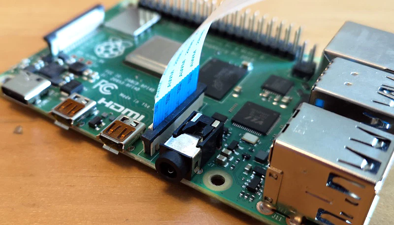

# Project 0: Applying Machine Learning Principles to ROS2
## Learning Objectives
- Practice writing ROS2 python scripts to control motors and sensors on the iRobot Create3
- Attach hardware to the Raspberry Pi and access data that can be used to determine the robot's actions
- Learn techniques in Machine Learning and use in code 

## Project Outline
This report outlines a more advanced project incorportating hardware and robotics concepts with Machine Learning. Students will use the iRobot Create3 with a Raspberry Pi Camera Module 3 and an ultrasonic sensor to navigate an obstacle course. Students will program robots to drive forward. If an object is within 6 inches of its path, students will take a photo using the Picamera2. Before running, students will use Google's Teachable Machine to create a trained data set on what 8 objects are but not their orientation or placement in the course. Thus, when they take a photo, the object will be identified accordingly. Prior to starting the final run through, students will be provided the course 10 minutes before, thus knowing whether to turn left or right after approaching the object. All turns should be 90 degrees.

## Resources needed
- iRobot Create3 robot
- Raspberry Pi 4
- Raspberry Pi Camera Module 3
- Google's [Teachable Machine](https://teachablemachine.withgoogle.com/train)
- Ultrasonic sensor (optional)

## Instructions

### Using the Raspberry Pi Camera Module 3 and creating the data set

To set up the Raspberry Pi Camera Module 3, lift up the flap of the J3 camera pin and insert the blue portion of the camera facing the audio check like so:



In order to be able to use the camera, we need to change the camera setting in the Raspberry Pi configuration page and download the package to be able to use the camera. First, download the camera package:

```
sudo apt install picamera2
```
Now, download the raspberry pi configuration:

```
sudo apt install raspi-config
```

Once this is installed, open the configuration by calling 
```
sudo raspi-config
```

Then, open interface options and disable Legacy Camera, and then reboot the pi


To test the camera, run the following python script:
```
from picamera2 import Picamera2
import time

picam2 = Picamera2()

# must start the camera before taking any images
picam2.start() 
time.sleep(1)

# capture image
picam2.capture_file('image.jpg')

picam2.stop()

```

Either using a code editor logged in to the pi or VNC viewer, this will allow you to see if the camera is taking photos, as you can view these photos in your desktop

Now that we know our camera is functioning, we can use it to train our Machine Learning Model.


### Training the Model

Google's Teachable Machine provides an intuitive first look at Machine Learning. 

First, [open the page](https://teachablemachine.withgoogle.com/train) and test the model using your web browser and computer camera, select image project, select standard image, and hold up objects to take images. Now, once the model is trained, we can use our webcam

Now that you have tested the Teachable Machine, we can train the model for our project accordingly. 

1. Take images with the camera in bulk and push to github
1. Download the zip file of images and unzip on your laptop
1. Start a new Teachable Machine project
1. Upload photos into their own categories, label categories, and produce the model

We can now use our model to identify objects

### Incorporating the model into code

Teachable Machine provides exportable code to be able to use our model with other python code. In order to do this: 
1. Export the model 
1. Select Tensorflow OpenCV Keras model
1. Download the model 
1. Unzip and place model & labels file in Github and download to the Pi
1. Create a new file on the Pi using the code from the model 
1. Install the teachable machine library onto the pi: 
    ```
    sudo pip3 install teachable-machine
    
    ```
However, the code currently runs using OpenCV, so we need to change this to run with the Picamera. Note, this is only the portion that needs to be replaced, and the initialization of libraries and model loading are still necessary. 


```
    # automatically 4608x2592 width by height (columns by rows) pixels picam2.configure(capture_config)
    capture_config = picam2.create_still_configuration()
    # sets auto focus mode
    picam2.set_controls({"AfMode": controls.AfModeEnum.Continuous}) 

    # must start the camera before taking any images
    picam2.start() 

    # Grab the webcamera's image
    img_name = 'image.jpg'
    # take image 
    picam2.capture_file(img_name)
    # read image with open cv, to get the bgr value 
    image = cv2.imread("image.jpg") 
    # Resize the raw image into (224-height,224-width) pixels
    image = cv2.rotate(image, cv2.ROTATE_90_COUNTERCLOCKWISE) 
    image = cv2.resize(image, (224, 224), interpolation=cv2.INTER_AREA)

    # Show the image in a window
    cv2.imshow("Webcam Image", image)

    # Make the image a numpy array and reshape it to the models input shape.
    image = np.asarray(image, dtype=np.float32).reshape(1, 224, 224, 3)

    # Normalize the image array
    image = (image / 127.5) - 1

    # Predicts the model
    prediction = model.predict(image)
    index = np.argmax(prediction)
    class_name = class_names[index]
    confidence_score = prediction[0][index]

    # Print prediction and confidence score
    print("Class:", class_name[2:], end="")
    print("Confidence Score:", str(np.round(confidence_score * 100))[:-2], "%")
```
Being sure to replace ```camera.release()``` with ```picam2.stop()```

Now, our program captures an image from our Picamera and analyzes the photo to predict what class the object in the image belongs to and we can begin writing code for the Create to move accordingly. 

### Controlling the Robot

First, to practice controling the robot, run the following:

```
import rclpy
from rclpy.node import Node
from std_msgs.msg import Float32

class DriveDistanceActionClient(Node):
    def __init__(self):
        super().__init__('drive_distance_action_client')
        self._action_client = ActionClient(self, DriveDistance, '/drive_distance')

    def send_goal(self, distance = 0.3, max_translation_speed = 0.1):
        goal_msg = DriveDistance.Goal()
        goal_msg.distance = distance
        goal_msg.max_translation_speed = max_translation_speed

        self._action_client.wait_for_server()

        self._send_goal_future = self._action_client.send_goal_async(goal_msg)

        self._send_goal_future.add_done_callback(self.goal_response_callback)

    def goal_response_callback(self, future):
        goal_handle = future.result()
        if not goal_handle.accepted:
            self.get_logger().info('Goal rejected :(')
            return

        self.get_logger().info('Goal accepted :)')

def main():
    rclpy.init()
    node = UltrasonicSensorNode()
    try:
        rclpy.spin(node)
    except KeyboardInterrupt:
        pass

    # Clean up resources
    finally: 
        node.destroy_node()
        rclpy.shutdown()
        GPIO.cleanup()

if __name__ == '__main__':
    main()
```

This program uses ROS2 actions to drive the robot forward some set distance. Actions are a communication type in ROS2 that are built on topics and services. Their functionality is similar to services, except actions are you can cancel them while executing. They also provide steady feedback, as opposed to services which return a single response. An “action client” node sends a goal to an “action server” node that acknowledges the goal and returns a stream of feedback and a result.

 
