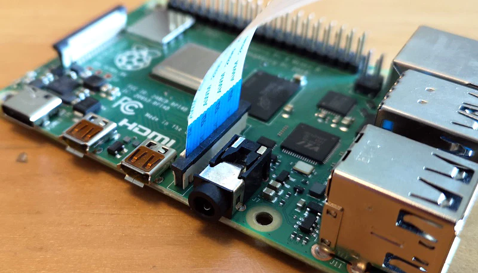

# Project 0: Applying Machine Learning Principles to ROS2
## Learning Objectives
- Practice writing ROS2 python scripts to control motors and sensors on the iRobot Create3
- Attach hardware to the Raspberry Pi and access data that can be used to determine the robot's actions
- Learn techniques in Machine Learning and use in code 

## Project Outline
With the rise of Aritificial Intelligence and Machine Learning, being able to help autonomous robots make informed decisions and being  capable of perceiving, reasoning, and adapting to their environment is essential to the world of robotics. 
This report outlines a more advanced project incorportating hardware and robotics concepts with Machine Learning. Students will use the iRobot Create3 with a Raspberry Pi Camera Module 3 and an ultrasonic sensor to navigate an obstacle course. Students will program robots to drive forward. If an object is within 6 inches of its path, students will take a photo using the Picamera2. Before running, students will use Google's Teachable Machine to create a trained data set on what 7 objects are but not their orientation or placement in the course. Thus, when they take a photo, the object will be identified accordingly. Prior to starting the final run through, students will be provided the course 10 minutes before, thus knowing whether to turn left or right after approaching the object. All turns should be 90 degrees.

Overall, your goal is to teach your robot to recognize 7 objects and use these objects to navigate a maze. 

Details:
- All turns will be 90 degrees except 
- A the last object, do something fun
- You must turn when the object is 6 inches from your camera
- You will not know ahead of time the orientation of the objects

## Resources needed
- iRobot Create3 robot
- Raspberry Pi 4
- Raspberry Pi Camera Module 3
- Google's [Teachable Machine](https://teachablemachine.withgoogle.com/train)
- Ultrasonic sensor (optional)

It will be most successful to test different processes modularly. Break down goals into substeps to test each process individually before implementing up and testing the system. This will provide a basic outline for one method of breaking down these steps.

## Instructions

### Using the Raspberry Pi Camera Module 3 and creating the data set

To set up the Raspberry Pi Camera Module 3, lift up the flap of the J3 camera pin and insert the blue portion of the camera facing the audio check like so:



In order to be able to use the camera, we need to change the camera setting in the Raspberry Pi configuration page and download the package to be able to use the camera. First, download the camera package:

```
sudo apt install picamera2
```
Now, download the raspberry pi configuration:

```
sudo apt install raspi-config
```

Once this is installed, open the configuration by calling 
```
sudo raspi-config
```

Then, open interface options and disable Legacy Camera, and then reboot the pi


To test the camera, run the following python script:
```
from picamera2 import Picamera2
import time

picam2 = Picamera2()

# must start the camera before taking any images
picam2.start() 
time.sleep(1)

# capture image
picam2.capture_file('image.jpg')

picam2.stop()

```

Either using a code editor logged in to the pi or VNC viewer, this will allow you to see if the camera is taking photos, as you can view these photos in your desktop

Now that we know our camera is functioning, we can use it to train our Machine Learning Model.


### Training the Model

Google's Teachable Machine provides an intuitive first look at Machine Learning. 

First, [open the page](https://teachablemachine.withgoogle.com/train) and test the model using your web browser and computer camera, select image project, select standard image, and hold up objects to take images. Now, once the model is trained, we can use our webcam

Now that you have tested the Teachable Machine, we can train the model for our project accordingly. 

1. Take images with the camera in bulk and push to github
1. Download the zip file of images and unzip on your laptop
1. Start a new Teachable Machine project
1. Upload photos into their own categories, label categories, and produce the model

We can now use our model to identify objects

### Incorporating the model into code

Teachable Machine provides exportable code to be able to use our model with other python code. In order to do this: 
1. Export the model 
1. Select Tensorflow OpenCV Keras model
1. Download the model 
1. Unzip and place model & labels file in Github and download to the Pi
1. Create a new file on the Pi using the code from the model 
1. Install the teachable machine library onto the pi: 
    ```
    sudo pip3 install teachable-machine
    
    ```
However, the code currently runs using OpenCV, so we need to change this to run with the Picamera. Use your code from the previous test to be able to do this. 

### Controlling the Robot

Write a program that uses ROS2 actions to drive the robot forward some set distance. In ROS2, actions are a way of communicating between different parts of the robot. Unlike regular services, actions allow you to cancel them while they are running and provide continuous feedback on the progress. In this setup, an "action client" node sends a goal to an "action server" node, which acknowledges the goal and continuously updates the client with feedback until the task is completed. The following may be helpful: [ROS2 actions](https://docs.ros.org/en/foxy/Tutorials/Beginner-CLI-Tools/Understanding-ROS2-Actions/Understanding-ROS2-Actions.html), [iRobot Create3 DriveDistance](https://github.com/iRobotEducation/irobot_create_msgs/blob/rolling/action/DriveDistance.action), and [iRobot Create3 RotateAngle](https://github.com/iRobotEducation/irobot_create_msgs/blob/rolling/action/RotateAngle.action)

First, configure a program to use actions to drive forward .3 meters. Next, configure a program to do this in response to an input from the user. Note that ROS requests are made asynchronously as a new thread, so python's time function will not be useful here. In your goal_response_callback, it may be helpful to include some of the following logic in your program:
```
# get some sort of input from another function
 self._wait_for_change = getInput()
# If something has changed, send action
    if self._wait_for_change:
        self.send_goal()

# separate from your goal_response_callback
def set_wait_for_change(self, wait):
    self._wait_for_change = wait

```


